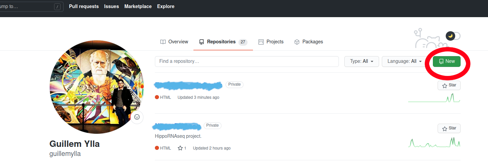
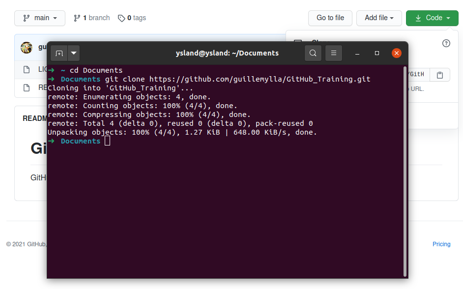

# GitHub Training

GitHub training for the Extavour lab
------------

## Table of contents

1. [Introduction](##Introduction)
2. [Create a GitHub account](##Create-a-GitHub-account)
3. [First time using git](##First-time-using-git)
4. [Create a repository from GitHub](##Create-a-repository-from-GitHub)
5. [Add files to the repository](##Add-files-to-the-repository)
6. [Edit files](##Edit-files)
7. [Commit changes](##Commit-changes)
8. [Make a Branch](##Make-a-Branch)
9. [Basic bash commands](##Basic-bash-commands)


----------

## Introduction

### What is git?

Git is a version-control tool that tracks changes made to the files and directories in a project.

### When do I want to use git?

The day that you write more than 1 line of code.  (That's my opinion)

### Why do I want to use git?

- To reproduce your analysis.
- To go back to previous versions of your scripts.
- To share your code.
- To collaborate.


### What is GitHub?

A cloud-base platform to host code and version control using git. There are many other similar platforms (GitLab, Bitbucket), with similar features. Since GitHub is one of the most popular platforms and offers a basic free tier for personal use and an advanced free tier for academia in this tutorial I will use GitHub.


### How does Git work?

Git creates snapshots of all your files and directories every time you "commit". Git takes a picture of what all your files look like at that moment and stores a reference to that snapshot. For efficiency, the files that are not changed are not stored again, Git just creates a link to the previous identical stored file.

This system allows the user to go back to any previous version of the project. It also allows to create project branches that are useful for exploring new ideas, or for allowing multiple people to work on the same project at once. Branches then can be merged to the main one if the user decides to keep the changes made on the branch. 


-------

## Create a GitHub account

1. Create an account: https://github.com/join

2. Follow the steps

3. Get a "GitHub  Education" account (optional): 
	- *"If you're an educator or a researcher, you can apply to receive GitHub Team for your organization account for free."* 
	- To "upgrade"  to Educator account follow this instructions : https://docs.github.com/en/education/teach-and-learn-with-github-education/apply-for-an-educator-or-researcher-discount

## First time using git

 - The first time you use git in a computer, you need to configure it
 
 ```
 $ git config --global user.name "your_username"
 $ git config --global user.email youremail@example.com
 ```

- Optional: if you want git to remember the password during a period of time.


```
git config credential.helper 'cache --timeout=<seconds>'
```

----------

## Create a repository from GitHub

1. Go to https://github.com/ and log in.
2. Go to your profile ("click on the top right icon"->"Your profile")
3. Click on "Repositories"
4. CLick on "New"



5. Choose a **name** for your repository, add a **Description** (optional) , define if it should be **public** or **private** , add a **README** file (optional), add **license** (optional).
6. "Create repository"


7. You will see the repository in your profile. If you chose to add a README, you will see it with its content (by default it will contain what you put as "Description").


8. Click on "Code" and copy the URL of your repository.


9. Go to your computer (or the cluster, or any machine you want), open the terminal, navigate to the directory of your choice, and **clone** the repository with the command:

```
git clone https://github.com/guillemylla/GitHub_Training.git
```


At this point, you have created a repository with a README file in GitHub and downloaded it to your computer.

------------

## Add files to the repository

After cloning the new repository now you can start your project.

1. Create a python scripts with your favorite text editor (NOT word processor.  Text editors are; NotePad, TextEdit, Gedit, nano, Sublime, Atom, etc. ).
2. Start tracking the file with git.
```
git add Hello_World.py
```
    * If you want to track **all files in the directory* at once you can do:
```
git add .
```
3. Commit (create a snapshot of the file)
    * Add a message indicating that is the first commit
```
git commit -m "my first commit"
```
4. Save the changes in the cloud (GitHub)
```
git push origin main
```
5. Go to GitHub and you should see the [Hello_World.py](Hello_World.py) file in the repository.

-----------

## Edit files

1. Let's edit the file Hello_world.py
2. Stage the file.
    * Git has a staging area in which it stores files with changes you want to save that haven't been saved yet. Putting files in the staging area is like putting things in a box, while committing those changes is like putting that box in the mail: you can add more things to the box or take things out as often as you want, but once you put it in the mail, you can't make further changes.
```
git add -u
```
3. If you check the status ``git status`` it will show you that the file has "changes to be committed". The snapshot has not yet been created.
    

## Commit changes


## Make a Branch

## Track file

## Basic Git commands


- git commit
- gt push
- git stash
- git fetch
- git merge
- git pull
- git show
- git status


Other useful commands
- Cache credentials - to avoid typing pwd at every push


Hands-on example


Create new repo

My first commit


- Can I create a cloud session? connected to a public repo on my account?

```
    git add FILE
    git commit -m "my first commit"
    git push origin main
     # main used to be called "master". Github recently removed unnecessary references to slavery
``` 

------------

## Basic bash commands

Bash is a command language for Unix shell (which means that are the same for MacOs and Linux, and different from Windows which uses DOS). 

The Bash commands that will appear in this tutorial are:

- ```cd```: change directory 
- ```mv```: move
- ```cp```: copy
- ```nano```: Command line text editor (there are others such as vim, emacs)


## Other things

- Host your websites
- Share posters (i.e. a QR code on your poster that redirects to the PDF hosted on github )


## Resources
- http://book.git-scm.com/book/en/v2
- https://ufresearchcomputing.github.io/git-training/
- https://git-scm.com/book/en/v2/Getting-Started-Installing-Git
- https://education.github.com/git-cheat-sheet-education.pdf


